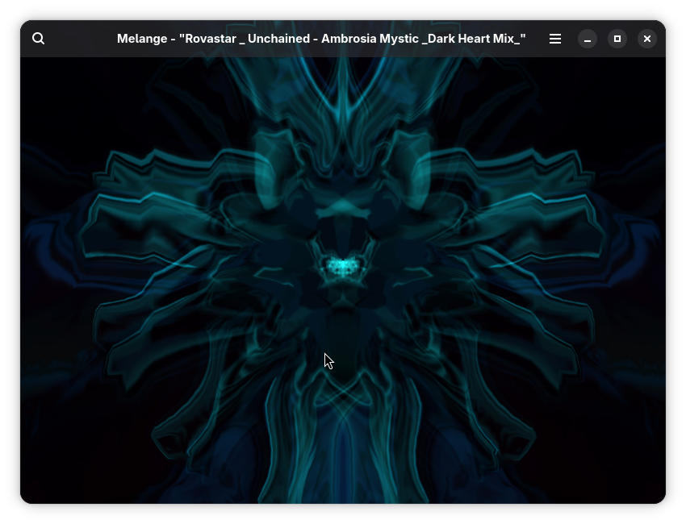
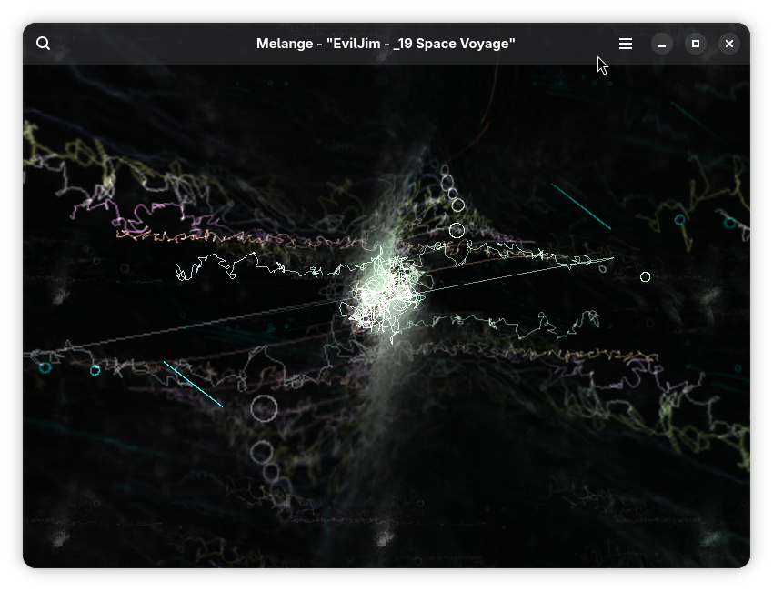
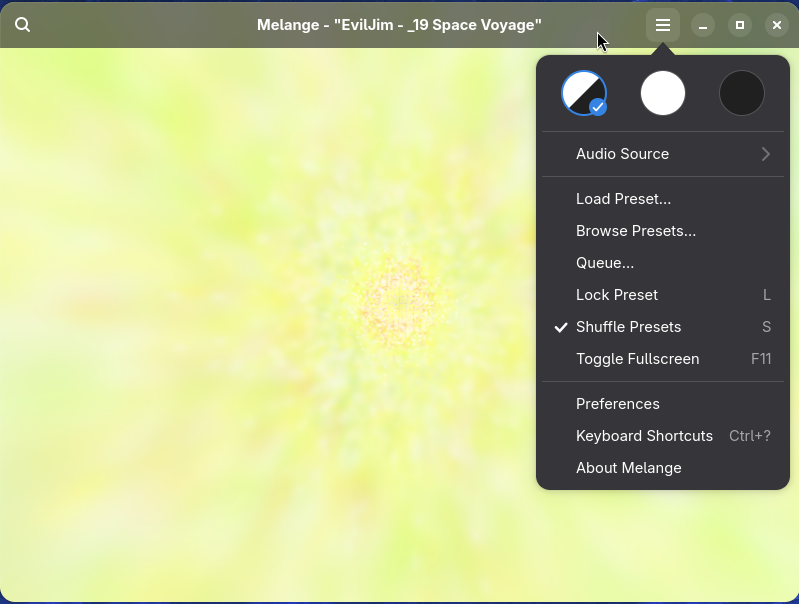
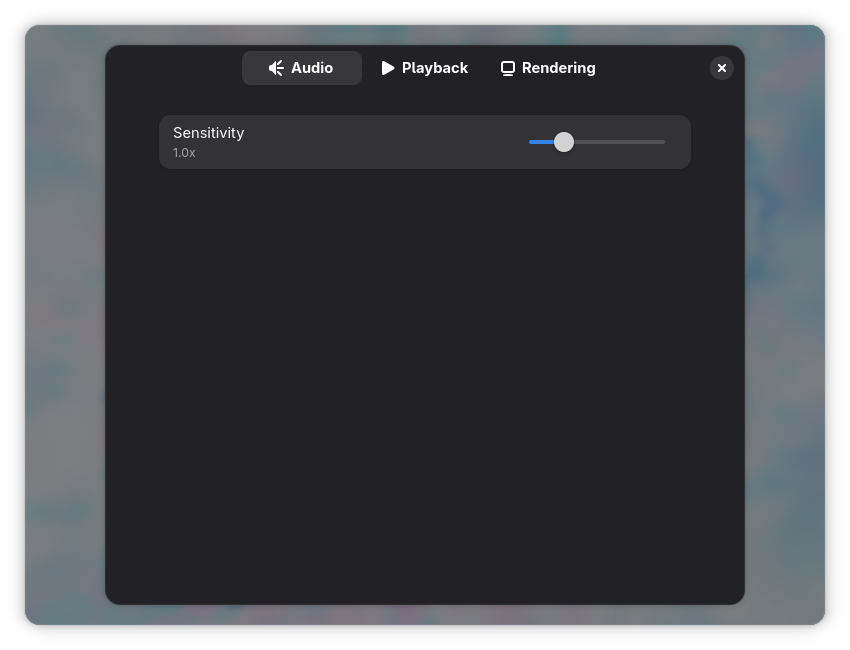
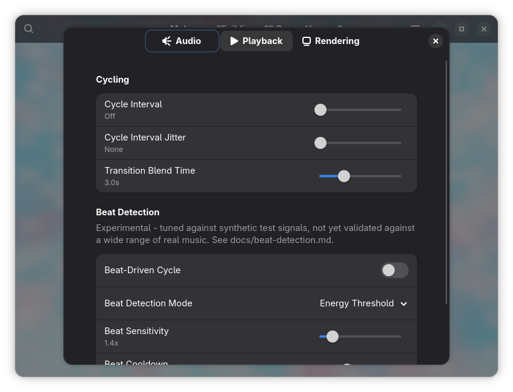
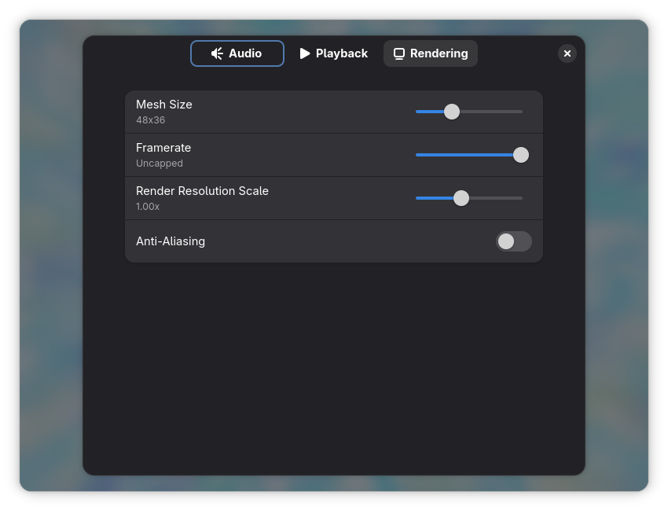

# Melange

A MilkDrop-style music visualizer for the Linux desktop, built on
[Butterchurn](https://github.com/jberg/butterchurn) and rendered natively
via GTK4/libadwaita + WebKitGTK. Reacts to system audio (or a microphone)
in real time, browses and loads MilkDrop (`.milk`) and native Butterchurn
(`.json`) presets, and ships with a curated preset collection out of the
box.

| | | |
| --- | --- | --- |
|  |  |  |

Preferences — Audio, Playback, and Rendering tabs:

| | | |
| --- | --- | --- |
|  |  |  |

## Features

- Real-time WebGL visualization via Butterchurn, driven by system audio
  (per-application/output capture) or a microphone
- Built-in preset library (butterchurn-presets +
  [butterchurn-presets-baron](https://github.com/uvmain/butterchurn-presets-baron),
  ~800 presets total) plus a searchable native preset browser with
  Presets/Favorites/Queue tabs
- Favorite presets, from an on-canvas star or per-row in the browser
- Load your own `.milk` (MilkDrop) or `.json` (Butterchurn) preset files
- Adjustable sensitivity, transition blend time, mesh resolution, and
  framerate cap
- Shuffle and auto-cycle preset advancement, with proper back/forward
  history navigation
- Preset lock, on-canvas navigation arrows, window title showing the
  current preset name, and a native preset search dialog
- Fullscreen mode, draggable borderless window

## Keyboard shortcuts

| Shortcut | Action |
| --- | --- |
| `→` / `Space` | Next preset |
| `←` | Previous preset |
| `L` | Toggle preset lock |
| `S` | Toggle shuffle |
| `F` | Toggle favorite |
| `F11` | Toggle fullscreen |
| `Esc` | Exit fullscreen |
| `Ctrl+O` | Load preset file |
| `Ctrl+F` | Browse presets |
| `Q` | Show queue |
| `Ctrl+M` | New mirror window |
| `Ctrl+Shift+M` | Close all mirrors |
| `Ctrl+,` | Preferences |
| `Ctrl+?` | Show keyboard shortcuts |
| `Ctrl+Q` | Quit |

Cycle interval, transition blend time, mesh size, sensitivity,
framerate, render resolution scale, anti-aliasing, and (experimental)
beat-driven cycling are all adjusted from the Preferences dialog
(hamburger menu → Preferences), grouped into Audio/Playback/Rendering
tabs.

## Building

Melange is a [Flatpak](https://flatpak.org/) app, built with Meson. The
web layer (`src/web`) is a small Vite-bundled JS app (Butterchurn +
preset packs) that gets built once and embedded; `node_modules` is
vendored directly in this repo so a plain flatpak-builder run doesn't
need network access to npm.

```sh
cd src/web && npm run build && cd ../..
flatpak-builder --user --install --force-clean build-dir com.cameronlp.Melange.json
flatpak run com.cameronlp.Melange
```

## Credits

- [Jordan Berg](https://github.com/jberg) — [Butterchurn](https://github.com/jberg/butterchurn),
  the WebGL MilkDrop-preset renderer this app is built on, plus the
  [MilkDrop preset conversion toolkit](https://github.com/jberg/milkdrop-preset-converter)
  used to load `.milk` files
- [baron](https://github.com/uvmain/butterchurn-presets-baron) — the
  bundled `butterchurn-presets-baron` preset pack

## License

GPL-3.0-or-later - see [COPYING](COPYING).
